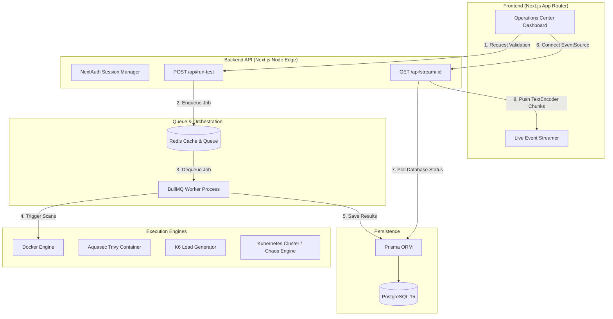

# Architecture & System Design

Resilience Cloud is built on a highly scalable, event-driven architecture designed to process hundreds of concurrent container validation pipelines without blocking the frontend.

## High-Level System Architecture

## Component Details

### 1. Redis + BullMQ Queue Manager
When a user initiates a validation pipeline for a Docker image, the Next.js API immediately acknowledges the request (HTTP 202 Accepted) and pushes a `PipelineJob` to Redis. A detached BullMQ worker process continuously polls Redis. This guarantees the web server remains highly available even when vulnerability scans take >60 seconds.

### 2. The Execution Orchestrator
The Worker process acts as a coordinator for multiple security and performance engines:
- **Sandbox Engine**: Dynamically provisions an ephemeral container of the target image and binds it to a random host port to simulate a Kubernetes Pod.
- **Security Engine**: Pulls the massive `aquasec/trivy` container and mounts the Docker socket to perform a live CVE vulnerability scan against the target image.
- **Load Engine**: Executes a local `k6` HTTP load test against the Sandbox container to measure P95 Latency and Requests Per Second.
- **Chaos Engine**: Injects a hostile `SIGKILL` into the Sandbox container while it is under load, simultaneously starting an internal stopwatch to calculate the application's Recovery Time Objective (RTO).

### 3. Server-Sent Events (SSE) Engine
To provide a "Live" experience, the frontend connects to a persistent `/api/stream/[id]` endpoint. The server routinely polls the Postgres database for state transitions in the active `TestRun` and pushes them as `Uint8Array` byte chunks to the browser. This allows the frontend to animate the Cluster Topology map in real-time.
